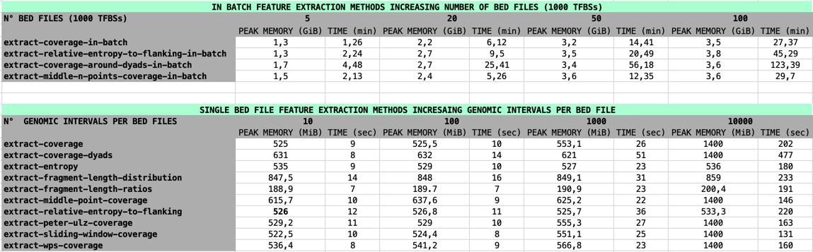

<div align="center">
	
</div>

----

[](CODE_OF_CONDUCT.md)
[](https://opensource.org/licenses/)
[](https://lbf.readthedocs.io/)


## New: singularity image installation 

have a look at the documentation for the singularity installation [here](https://lbf.readthedocs.io/)

## Introduction.


LBFextract is a Python package for extracting features for all genomic intervals described in a Browser Extensible Data (BED) file or multiple BED files, from a Binary Alignment Map (BAM) file and identifying condition-specific or cluster-specific differentially active Transcription Factors (TF).
It focuses on liquid biopsy related features, transcription factor binding sites (TFBSs) and Transcription Start Sites (TSSs), but can be generalized to any kind of genomic intervals with similar properties. 
The package is built as a plugin interface, in which each plugin is a feature. It is composed by a core package, which contains the main logic, and a set of
plugins, which represent the features extraction methods. The core package (lbfextract) describes the workflow and how different hooks will be executed to extract the features. 
The plugins implement the hooks. Default coverage-based and fragmentoimics-based feature extraction methods are provided as lbfextract subpackages. 

The following feature extraction methods are available:

- coverage
- coverage-in-batch
- central-60b (Peter Ulz coverage)
- sliding-window-coverage
- sliding-window-coverage-in-batch
- wps-coverage
- coverage-around-dyads
- coverage-around-dyads-in-batch
- middle-point-coverage
- middle-point-coverage-in-batch
- middle-n-points-coverage
- middle-n-points-coverage-in-batch
- entropy
- entropy-in-batch 
- fragment-length-distribution ( per position )
- fragment-length-distribution-in-batch ( per position )
- fragment-length-ratios ( per position )
- relative-entropy-to-flanking
- relative-entropy-to-flanking-in-batch
- extract-signal

## LBF plugins

- [jsd_to_flanking](https://github.com/Isy89/fextract_jsd_to_flanking)
- [cool_signal_name](https://github.com/Isy89/fextract_cool_signal_name) (plugin example discussed in the [documentation](https://lbf.readthedocs.io/en/latest/plugins.html))

## Installation

For the installation of LBFextract, the following is required:

    - python>=3.10
    - conda 
    - setuptools~=62.0.0

conda is used to create a separate environment used by LBFextract, such that the user conda environment is 
not influenced. 

To be able to run the tests also the following python package is required:

    - pytest~=8.1.1


LBFextract can be installed as follows:

## Strategy 1 

If you are already in a conda env with python 3.10 and setuptools the package can be directly installed with:
```bash
python -m pip install .
```
or also directly from github without the need to clone the repository:

```bash
python -m pip install "lbfextract @ git+https://github.com/Isy89/LBF.git"
```

if there is no conda with the required requirements, one can install the conda env with the given yml file
This can be achieved with the following installation strategy 

## Strategy 2

### Step 1: clone the repository

```bash
git clone https://github.com/Isy89/LBF.git && cd LBF
```

## Step 2: create a conda env

create a conda env with the essential to install the package:

```bash
conda env create -n env_name -f conda_env.yml -y && conda activate env_name
```

### Step 3: install the package

```bash
python -m pip install .
```


After the installation, the command line interface lbfextract should be available.
Using it, a conda environment isolated from the current one containing samtools need to be created.
To install this conda env run the following command:

```bash
lbfextract setup create-conda-envs # creates a separate conda env used for filtering the bam files and other steps
```

if using bash, autocompletion can be enabled (at the moment it only supports autocompletion for bash, other shells will be added in the feature...):

```bash
lbfextract setup enable-autocompletion
```

and disabled:

```bash
lbfextract setup disable-autocompletion
```
## Computational requirements 

### Recommended System Requirements

- **Operating System:** Linux, macOS
- **Memory:** 8 GB RAM or more depending on the number of BED files used, the number of genomic intervals per BED file 
  and length of the genomic intervals used including the flanking regions

In the following tables, we provide a reference for the peak of memory usage and time required for the analysis 
of a 20x sample using different feature extraction methods and varying the number of BED files and the number
of genomic intervals used. For this analysis, 8 cores were used and the length of a genomic interval
was kept equal to 4000 bp.



## Documentation

[https://lbf.readthedocs.io/en/latest/](https://lbf.readthedocs.io/en/latest/)

## Paper/Cite

If you want to have a look at the paper, you can find it [here](https://doi.org/10.1016/j.csbj.2024.08.007).
Please, if you use LBFextract in your work, cite the following paper:

```bibtex
@article{LAZZERI20243163,
title = {LBFextract: Unveiling transcription factor dynamics from liquid biopsy data},
journal = {Computational and Structural Biotechnology Journal},
volume = {23},
pages = {3163-3174},
year = {2024},
issn = {2001-0370},
doi = {https://doi.org/10.1016/j.csbj.2024.08.007},
url = {https://www.sciencedirect.com/science/article/pii/S200103702400268X},
author = {Isaac Lazzeri and Benjamin Gernot Spiegl and Samantha O. Hasenleithner and Michael R. Speicher and Martin Kircher},
keywords = {Cell-free DNA, Bioinformatics, Whole-genome sequencing, Transcription factors, Fragmentomics},
abstract = {Motivation
The analysis of circulating cell-free DNA (cfDNA) holds immense promise as a non-invasive diagnostic tool across various human conditions. However, extracting biological insights from cfDNA fragments entails navigating complex and diverse bioinformatics methods, encompassing not only DNA sequence variation, but also epigenetic characteristics like nucleosome footprints, fragment length, and methylation patterns.
Results
We introduce Liquid Biopsy Feature extract (LBFextract), a comprehensive package designed to streamline feature extraction from cfDNA sequencing data, with the aim of enhancing the reproducibility and comparability of liquid biopsy studies. LBFextract facilitates the integration of preprocessing and postprocessing steps through alignment fragment tags and a hook mechanism. It incorporates various methods, including coverage-based and fragment length-based approaches, alongside two novel feature extraction methods: an entropy-based method to infer TF activity from fragmentomics data and a technique to amplify signals from nucleosome dyads. Additionally, it implements a method to extract condition-specific differentially active TFs based on these features for biomarker discovery. We demonstrate the use of LBFextract for the subtype classification of advanced prostate cancer patients using coverage signals at transcription factor binding sites from cfDNA. We show that LBFextract can generate robust and interpretable features that can discriminate between different clinical groups. LBFextract is a versatile and user-friendly package that can facilitate the analysis and interpretation of liquid biopsy data.
Data and Code Availability and Implementation
LBFextract is freely accessible at https://github.com/Isy89/LBF. It is implemented in Python and compatible with Linux and Mac operating systems. Code and data to reproduce these analyses have been uploaded to 10.5281/zenodo.10964406.}
}
```

## Copyright

Original work on lbfextract package and subpackages accessory code Copyright (c) 2023 Isaac Lazzeri

## Licence

GNU General Public License v3.0

## Contact

For any questions please contact:

* <LBFextract@gmail.com>

If you find any bugs please report them here:

* <https://github.com/Isy89/LBF/issues> 
