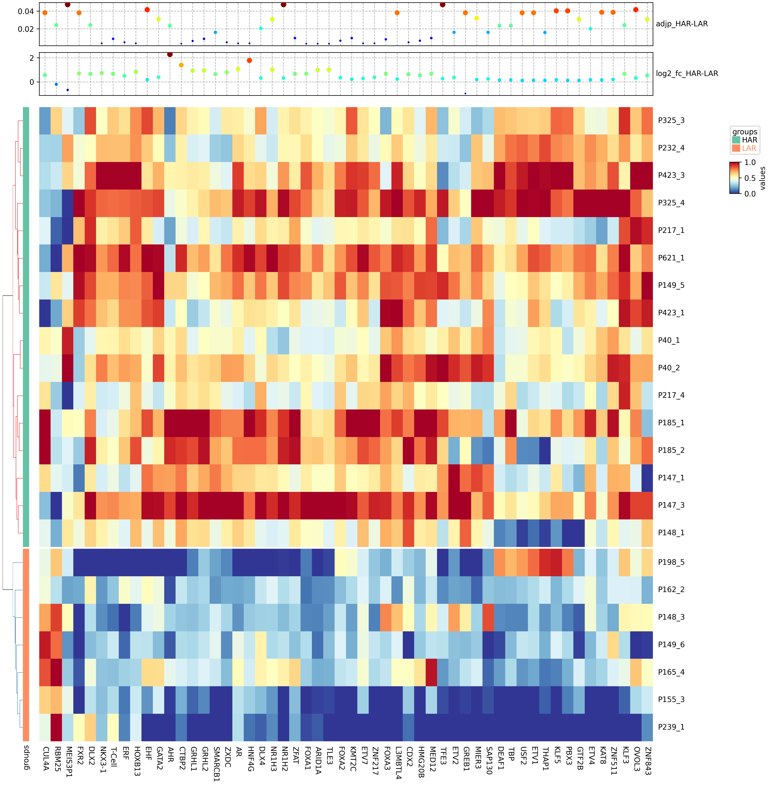

Differential Transcription Factor Activity Analysis
=====================================================
.. warning::

    **Temporary documentation**

Once coverage-based or fragmentomics-based features have been generated for multiple Transcription Factors (TFs), it is
possible to derive condition/cluster/group-specific differentially active TFs. `LBFextract` offers "post_extraction_analysis_commands"
which enables this analysis to be performed. To achieve this, a sample sheet (a ".csv" file) containing the paths to the
signals in a column, the group membership in the group column, and other relevant information needs to be generated and 
filled. 

LBFextract enables automatic generation of the sample sheet, which can be obtained with the following command:

.. code-block:: bash
    
    $ lbfextract post_extraction_analysis_commands --path_to_res_summary DIRECTORY --path_to_sample_sheet FILE generate-sample-sheet

This command generates a sample sheet in the correct format, which can then be filled with the necessary information. 
`path_to_res_summary` represents the root folder where the signals have been stored. LBFextract will parse it and load 
all the CSV files present in there. The structure of the generated file will be as follows:

`index, sample_name, group, tumor_fraction, cov, signal_type, bed_file_metadata, path_to_res_summary,paths_to_sample_result`

Possible extra columns representing different group definitions can be added. For the differentially active analysis, 
the only essential columns are: `index`, `paths_to_sample_result`, and `group`. `index` and `path` are automatically 
filled. The `group` column needs to be filled. The `sample_name`, `bed_file_metadata`, and `signal_type` columns are 
automatically filled too, but may need to be updated (i.e., The name used in the `sample_name` column is the name of 
the file containing the signal. A shorter one may be desired).

After the generation of the sample sheet, the analysis can be performed with the following command:

.. code-block:: bash
    
    $ lbfextract post_extraction_analysis_commands --path_to_res_summary DIRECTORY --path_to_sample_sheet FILE --signal_length INTEGER --center_signal_indices TEXT --flanking_signal_indices TEXT --output_path DIRECTORY --outer_group_column TEXT --correction_method TEXT --remove_outliers --save_individual_plots get-differentially-active-genomic-intervals

With this analysis, LBFextract will load all the signals for the defined TFs, extract the accessibility of each one of 
them for each sample, and generate a matrix of samples by TFs which will be used to find the differentially active TFs 
between groups.

The results will include:

- A table containing all TFs with adjusted p-values, log2 fold changes, and other summary statistics.
- A table containing the enrichment analysis.
- Summary plots per TF containing the signal per group.
- A heatmap containing the differentially active TFs found, the log2 fold values, and the adjusted p-values.

