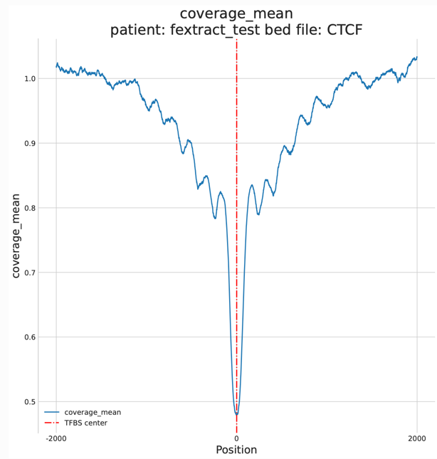
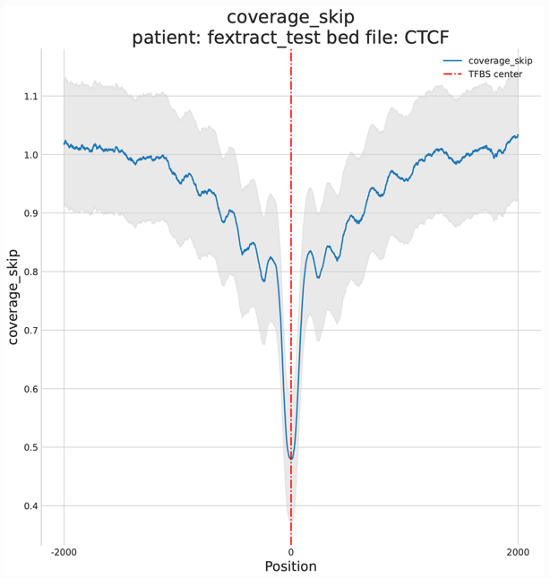
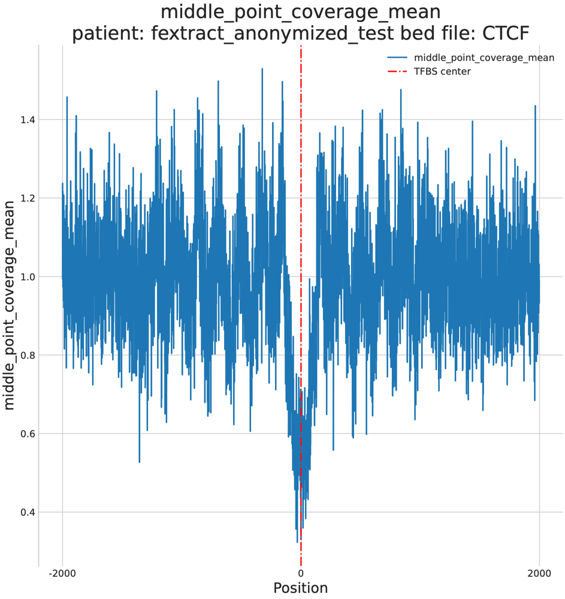
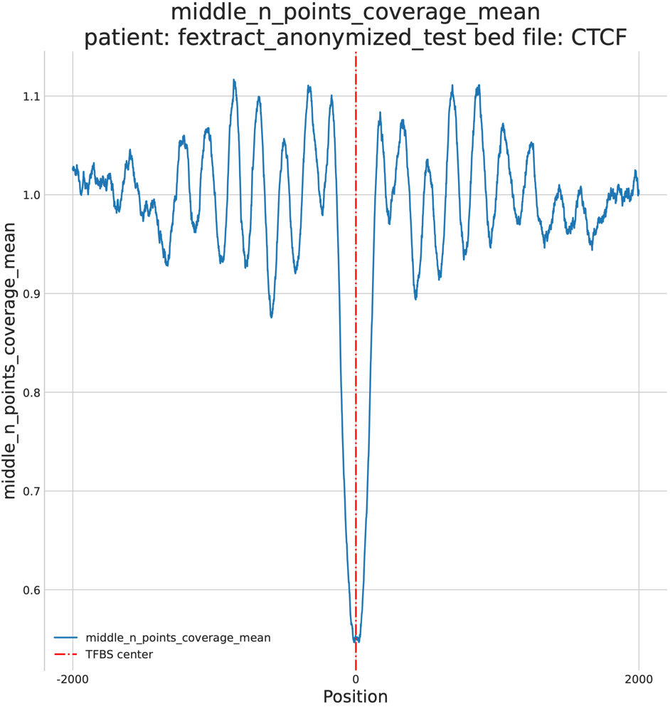
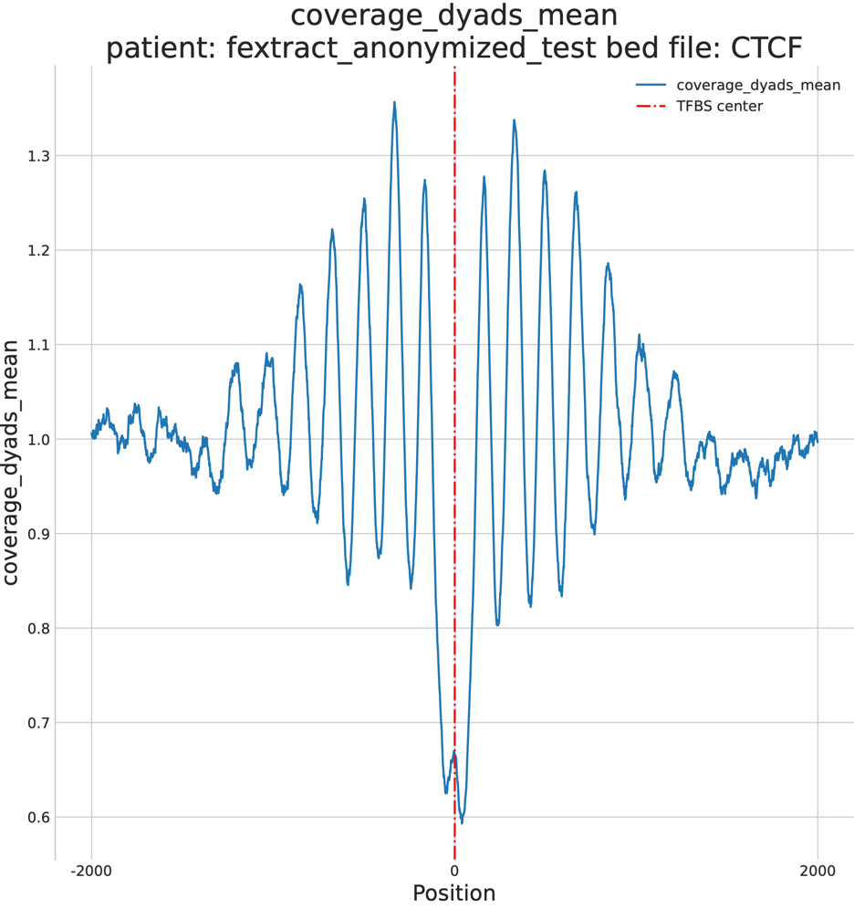
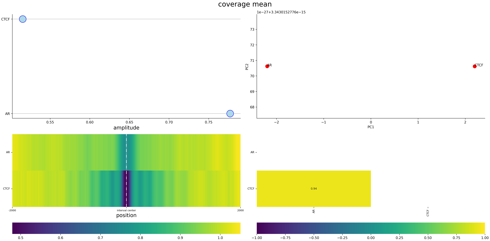
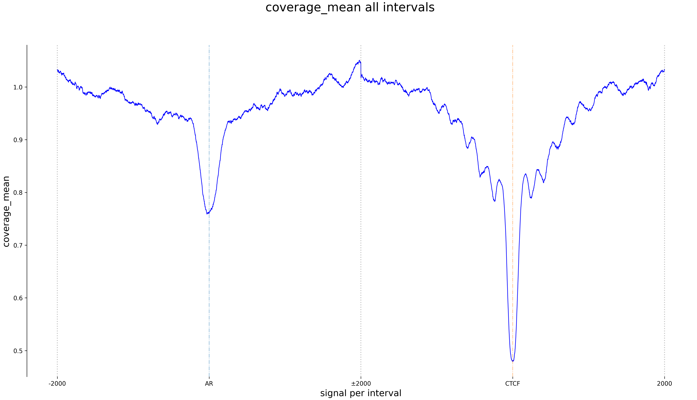
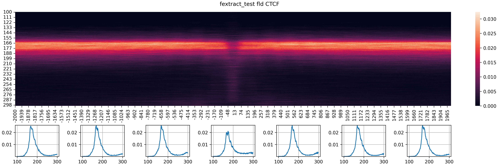
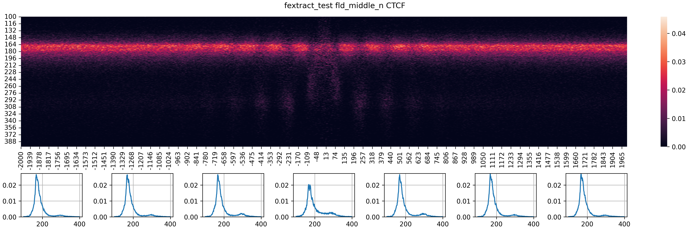
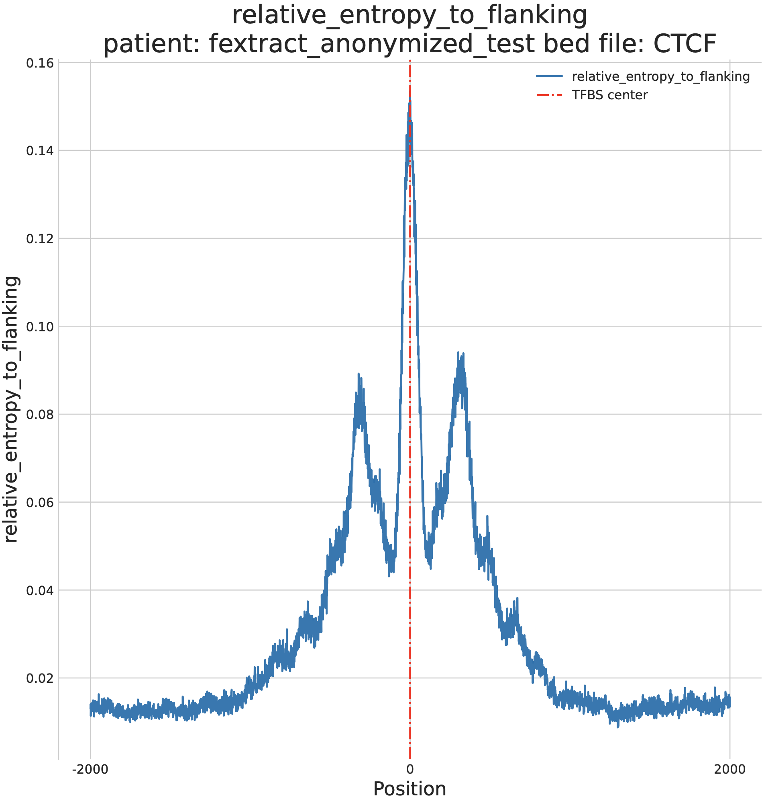

Examples 
===========

Here we provide examples of what can be done with LBFextract. 

Coverage
--------

.. code-block:: bash

    $ lbfextract  feature_extraction_commands extract-coverage --path_to_bam <path_to_bam> --path_to_bed <path_to_bed> --output_path <path_to_output_dir> --summarization_method mean

The result will be a plot as well as the signal saved in pickled format. A Signal object is composed by:
- array, which is a numpy ndarray
- metadata which can be everything that is pickable and should contain important metadata for the signal
- tags corresponds to the name of the plugins used at each step to generate the signal. 

.. code-block:: bash

    $ lbfextract  feature_extraction_commands extract-coverage --path_to_bam <path_to_bam> --path_to_bed <path_to_bed> --output_path <path_to_output_dir> --summarization_method skip

the summarization step can be also skipped. In this case, the signals of each genomic interval are not averaged at each 
position, but are reported as they are in form of a numpy ndarray with a shape number of intervals times positions
The plot in this case will include the information about the variability of the signal across genomic intervals

Similarly, we can extract the signals for multiple BED files using the signals with the in_batch suffix. This is much faster
than running the signal extraction for each BED file one by one. In this case, a directory must be passed to the --path_to_bed.
The folder should contain the BED files.

.. code-block:: bash

    $ lbfextract  feature_extraction_commands extract-coverage-in-batch --path_to_bam <path_to_bam> --path_to_bed <path_to_bed_dir> --output_path <path_to_output_dir> --summarization_method skip

For in-batch feature extraction methods, different plots are provided plus a csv contaning the signals for all the BED files, 
one for row.

.. code-block:: bash

    $ lbfextract  feature_extraction_commands extract-middle-point-coverage --path_to_bam <path_to_bam> --path_to_bed <path_to_bed> --output_path <path_to_output_dir>

.. code-block:: bash

    $ lbfextract  feature_extraction_commands extract-middle-n-points-coverage --path_to_bam <path_to_bam> --path_to_bed <path_to_bed> --output_path <path_to_output_dir>

.. code-block:: bash

    $ lbfextract  feature_extraction_commands extract-coverage-dyads --path_to_bam <path_to_bam> --path_to_bed <path_to_bed> --output_path <path_to_output_dir>

Summary plot
~~~~~~~~~~~~

The summary plot provides a summary of the top and bottom n genes in terms of peak in the middle around the center of the
interval, which for TFBSs and TSSs correspond to the point in which a dip or a peak should be observed.
In this summary, the amplitudes are reported for the top and bottom n genes as well as their correlation and the PCA plot showing 
their position in a latent space based on their profiles.

Batch coverage plot
~~~~~~~~~~~~~~~~~~~

The batch coverage plot plots the signal one next to the other

Fragment Length Distribution
----------------------------

The fragment length distribution signals calculates the fragment length distribution per position. i.e. 
at position i, for each interval in the bed file, the total amount of reads, which overlap with it, will be used to calculated the 
fragment length distribution at that position.
This is repeated for all positions.
Depending on the type of coverage used, different fragment length distributions can be extracted. These  help better 
understanding the coverage plots and see how different fragment lengths contribute to the coverage signal.

Fragment Length Distribution - coverage middle n points
~~~~~~~~~~~~~~~~~~~~~~~~~~~~~~~~~~~~~~~~~~~~~~~~~~~~~~~

Relative Fragment Entropy 
~~~~~~~~~~~~~~~~~~~~~~~~~

