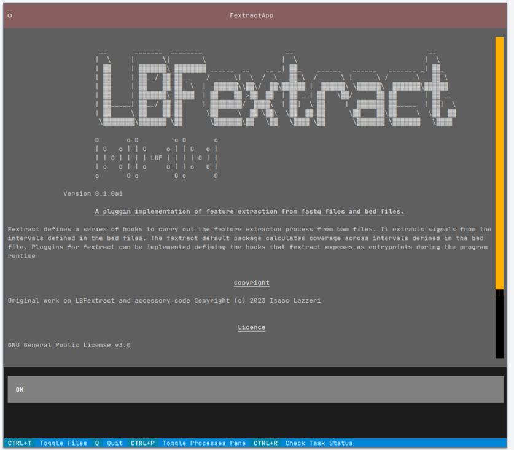

Get started
===========

cli tutorial
------------

The cli tutorial is a good place to start. It will walk you through 
the basics of using the command line interface.
After installation of the package, you start the CLI interface by typing:

.. code-block:: bash

    $ lbfextract --help

at the bottom of the help message you will find a list of all available commands.
To get more information about a specific command, type:

.. code-block:: bash

    $ lbfextract <command> --help

The following feature extraction methods are available:

* feature_extraction_commands
    * extract-coverage
    * extract-coverage-in-batch
    * extract-coverage-around-dyads
    * extract-coverage-around-dyads-in-batch
    * extract-middle-point-coverage
    * extract-middle-point-coverage-in-batch
    * extract-middle-n-points-coverage
    * extract-middle-n-points-coverage-in-batch
    * extract-entropy
    * extract-entropy-in-batch
    * extract-fragment-length-distribution
    * extract-fragment-length-distribution-in-batch
    * extract-relative-entropy-to-flanking
    * extract-relative-entropy-to-flanking-in-batch

* post_extraction_analysis_commands
    * generate-sample-sheet
    * get-differentially-active-genomic-intervals

* setup
    * create-conda-envs
    * disable-autocompletion
    * enable-autocompletion
    * new-plugin

* start-tui

Results
-------

Each feature extraction method creates a folder at the output path defined by the user. 
In the output folder the signal and the related plots are saved.

GC correction
-------------

LBFextract is compatible with GC correction methods
like `GCparagon <https://github.com/BGSpiegl/GCparagon>`_ , which provides a fragmetn alignment tag for each read in the bam file describing the correction factor 
to be applied to each allignment fragment.
Results of the GC correction can be appreciated in the following figure:

tui tutorial
------------
.. warning::

    **Early Stage Development**: Please note that this feature is still in its early stages of development. As such, users should expect potential issues, breakages, or incomplete functionality. 

    We appreciate your patience and understanding as we work to improve and stabilize this feature. Your feedback and bug reports are valuable in helping us enhance the installation process. 

    Stay tuned for updates on the progress of this feature. 

tui can be started as follows:

.. code-block:: bash

    $ lbfextract start-tui --path_to_root_dir <path_to_root_dir>

python api tutorial
-------------------

LBFextract offers a class to use all feactuer extraction method directly from python.
The class is called ``FeatureExtractor`` and can be imported as follows:

.. code-block:: python
    :linenos:

    from lbfextract.feature_extractor import FeatureExtractor
    fe = FeatureExtractor()

The FeatureExtractor class, which is initialized in line 2, has 4 methods: a help, a `get_exctractor_names`, 
a `get_help_for_extractor` and an `extract` methods. 
The `get_exctractor_names` method returns a list of all available feature extraction methods as shown in the following
example:

.. code-block:: python
    :linenos:

    fe.get_exctractor_names()

.. code-block:: python
    :linenos:

        [
            'extract-coverage',
            'extract-entropy',
            'extract-fragment-length-distribution',
            'extract-fragment-length-distribution-in-batch',
            ... 
        ]

The `get_help_for_extractor` method returns the help message of a specific feature extraction method as shown in the 
following example:

.. code-block:: python
    :linenos:

    fe.get_help_for_extractor("extract_coverage_around_diads")

.. code-block:: python
    :linenos:

    extractor extract_coverage_around_diads with following parameters:
    path_to_bam(None) => path to the bam file to be used 
     path_to_bed(None) => path to the bed file to be used 
     output_path(None) => path to the output directory 
     skip_read_fetching(False) => Boolean flag. When it is set, the fetching of the reads is skipped and the latest timestamp of this run (identified by the id) is retrieved 
     exp_id(None) => run id 
     window(1000) => Integer describing the number of bases to be extracted around the middle point of an interval present in the BED file 
     flanking_window(1000) => Integer describing the number of bases to be extracted after the window 
     extra_bases(2000) => Integer describing the number of bases to be extracted from the BAM file when removing the unused bases to be sure to get all the proper pairs, which may be mapping up to 2000 bs 
     n_binding_sites(1000) => number of intervals to be used to extract the signal, if it is higher then the provided intervals, all the intervals will be used 
     summarization_method(mean) => method to be used to summarize the signal: { mean, median, max, min } 
     percentage_of_trimming(0.1) => Percentage of bases to be removed from the sides of a read. This is generally useful with liquid biopsy data when the presence of the nucleosome dyad is assumed to be at the center for reads below 170 bp 
     cores(1) => number of cores to be used for the computation 
     flip_based_on_strand(False) => flip the signal based on the strand 
     gc_correction_tag(None) => tag to be used to extract gc coefficient per read from a bam file 

The extract method is the most important method of the FeatureExtractor class. It starts the feature extraction process 
and returns a list with the Signal object and the plot figure generated.

.. code-block:: python
    :linenos:

    fe.extract(
        "extract_coverage_around_diads", **{
        "path_to_bam": path_to_bam,
        "path_to_bed": path_to_bed,
        "output_path": path_to_results_range_specific
    })
    
.. code-block:: python
    :linenos:

    [Signal(obj), Figure(obj)]

