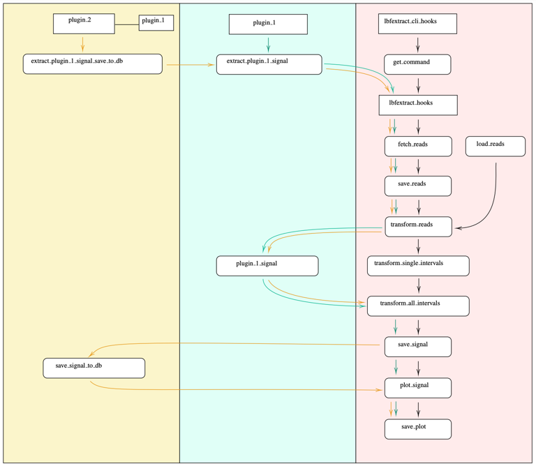

Learn about LBFextract
======================

Introduction
------------

LBFextract is a Python package for extracting features for all genomic intervals described in a Browser Extensible Data 
(BED) file or multiple BED files, from a Binary Alignment Map (BAM) file and identifying condition-specific or 
cluster-specific differentially active Transcription Factors (TF).
It focuses on liquid biopsy related features, transcription factor binding sites (TFBSs) and Transcription Start Sites
(TSSs), but can be generalized to any kind of genomic intervals with similar properties. 
The package is built as a plugin interface, in which each plugin is a feature. It is composed by a core package, which 
contains the main logic, and a set of plugins, which represent the features extraction methods. The core package 
(lbfextract) describes the workflow and how different hooks will be executed to extract the features. 
The plugins implement the hooks. Default coverage-based and fragmentomics-based feature extraction methods are provided 
as lbfextract subpackages. 

The following feature extraction methods are available:

- coverage
- coverage-in-batch
- central-60b (Peter Ulz coverage)
- sliding-window-coverage
- sliding-window-coverage-in-batch
- wps-coverage
- coverage-around-dyads
- coverage-around-dyads-in-batch
- middle-point-coverage
- middle-point-coverage-in-batch
- middle-n-points-coverage
- middle-n-points-coverage-in-batch
- entropy
- entropy-in-batch 
- fragment-length-distribution ( per position )
- fragment-length-distribution-in-batch ( per position )
- fragment-length-ratios ( per position )
- relative-entropy-to-flanking
- relative-entropy-to-flanking-in-batch
- extract-signal

These feature extraction methods are implemented as plugins that overwrite a specific hook in lbfextract workflow.

The current available hooks that can be implemented by plugins are:

* ***fetch_reads***: extract the feature from a bam file
* ***load_reads***: load reads in case they were already extracted
* ***save_fetched_reads***: save the fetched reads specific to the regions of interest
* ***transform_reads***: apply a transformation to each read extracted
* ***transform_single_intervals***: extract the signal of one region
* ***transform_all_intervals***: apply a transformation which requires all the regions
* ***plot_signal***: plot the final signal
* ***save_signal***: save the final signal

LBFextract provides also CLIhooks which, if provided, allow the automatic integration of all 
the plugins with LBFextract Command Line Interface (CLI) and Terminal User Interface (TUI).

installation
------------
For the installation of LBFextract, the following is required:

- python>=3.10
- conda 
- setuptools~=62.0.0

LBFextract uses conda to create a separate environment for dependencies, which are not Python related ( samtools ). 

To be able to run the tests, the following Python package is also required:

- pytest~=8.1.1

LBFextract can be installed as follows:

.. code-block:: bash

    git clone https://github.com/Isy89/LBF.git && cd LBF
    python -m pip install .

After the installation, the command line interface `lbfextract` should be available. Using it, a conda environment 
isolated from the current one containing samtools need to be created. The installation of this conda env can be done 
as follows:

.. code-block:: bash

    lbfextract setup create-conda-envs # creates a separate conda env used for filtering the bam files and other steps

Singularity Image isntallation
-------------------------------

To install LBFextract using the Singularity image, the following steps are required:

.. code-block:: bash

    singularity pull lbfextract_v0.1.0a1.sif library://lbfextract/lbfextract/lbfextract_v0.1.0a1.sif:0.1.0a1
    singularity run lbfextract_v0.1.0a1.sif --help

Using the run command you will have access to the lbfextract command line interface.
When using the singularity image it may be necessary to bind the directory containing the BAM files and BED files and
the output directory to the singularity container. This can be done using the following command:

.. code-block:: bash

    singularity run --bind /path/to/data_bam:/data_bam --bind /path/to/data_bed:/data_bed --bind /path/to/output_dir:/output_dir lbfextract_v0.1.0a1.sif --help

example:

.. code-block:: bash

    singularity run --bind /path/to/data_bam:/data_bam --bind /path/to/data_bed:/data_bed --bind /path/to/output_dir:/output_dir lbfextract_v0.1.0a1.sif feature_extraction_commands extract-coverage --path_to_bam /data_bam/example.bam --path_to_bed /data_bed/example.bed --output_path /output_dir

Coming Soon: Installation via pip (PyPI)
-----------------------------------------

We are currently working on making LBFextract installable directly from the Python Package Index (PyPI) using pip. This 
feature will allow for easier installation and distribution across different platforms.

Stay tuned for updates on when this feature will be available. In the meantime, please refer to the installation 
instructions provided above.

usage
-----

LBFextract can be used through the command line interface (CLI), through the
terminal user interface (TUI) or through the python API.

The CLI offers four major set of commands:

1. feature_extraction_commands
2. post_extraction_analysis_commands
3. setup
4. start-tui

The first set of commands are used to extract the features from the bam file.
The second set of commands are used to analyze the extracted features.
The third set of commands are used to setup the conda environments required
for the features present in LBFextract to work.
The fourth command is used to start the TUI interface.
